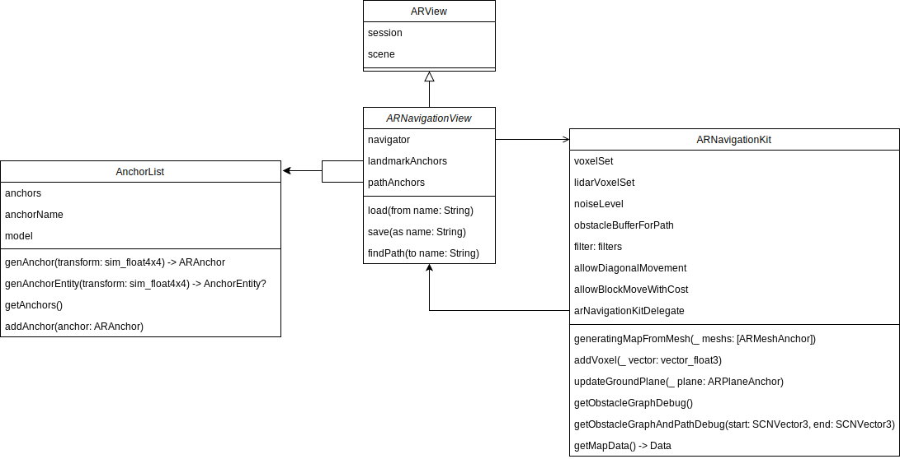

# Indoor Navigation이란?

 실내에서 목적지까지 길 안내하는 것을 indoor navigation이라고 합니다. 그러면 outdoor navigation (우리가 흔히 운전할 때 사용하는 navigation)과 어떤 차이점이 있을까요? 둘의 차이점을 이해하기 위해서는 navigation이 어떻게 동작하는 지 알아야 합니다.  동작하는 방식은 아래와 같습니다.

1. 길을 찾기 위한 공간을 지도(weighted undirected graph)로 표현합니다.

2. 현재 위치를 지도 상에서 찾아내고. 

3. 도착위치를 지도 상에서 특정해내면 최적 경로 알고리즘을 활용하여 길을 찾아냅니다.

Indoor Navigation과 outdoor navigation의 차이는 1.과 2.에서 나타납니다.

 1. outdoor navigation은 이미 주어진 도로 교통 정보가 있고 이를 활용하지만 실내의 경우 미리 주어진 자료가 없어 직접 지도를 생성해야 합니다.

 2. outdoor navigation은 GPS 정보를 활용하여 자신의 위치를 특정하지만, 오차 범위가 대략 20m가 되는 이 센서를 실내에서 활용할 수 없습니다. 그래서 다양한 센서 (LiDAR, IMU, Camera)등을 통해 주변을 mapping하는 동시에 자신의 위치를 특정합니다. (이를 SLAM이라고 부릅니다.)

이 때문에 indoor navigation은 더 높은 난이도를 가지고 있습니다.

# 어떻게 해결하고자 했는가

  해결해야 할 문제는 두 가지 였습니다.

1. iOS 모바일 기기로 손쉬운 mapping 및 지도의 재사용
2. iOS 모바일 기기의 다양한 센서들을 이용한 localization

일반적인 자율주행은 두 프로세스로 이뤄집니다. SLAM과 Path planning인데 SLAM은 주변을 mapping하고 자신의 위치를 특정하는 알고리즘이며 해당 정보를 바탕으로 Path planning을 적용하여 최적 경로를 찾아냅니다. 이 알고리즘을 실내에 적용하여 아래와 같이 위 문제를 해결하였습니다.

### 1. SLAM - ARWorldMap

- ARWorldMap은 ARKit가 내부적으로 실행하는 SLAM 결과를 저장하는 class입니다.
- 이 class의 instance를 저장하고 불러올 수 있어 장소에 대한 persistency를 제공합니다.
- 이 정보를 Session Configuration (ARConfiguration을 상속받는)의 initialWorldMap 변수에 할당하면 session이 해당 map으로 초기화 됩니다.
- mapping은 자신의 위치를 특정(localization)함과 동시에 path planning을 위해 사용 되지만 ARWorldMap의 정보는 wrapping되어 path planning에 사용할 수 없고 ARKit가 내부적으로 핸드폰의 위치를 특정하는데 사용됩니다. 따라서 path planning을 위한 map을 따로 작성해야 합니다.

### 2. Path Planning - ARNavigationKit

- SLAM으로 얻은 map & position 정보를 활용하여 Path Planning을 진행합니다.
- ARKit의 내부 mapping 결과를 확인할 수 없기 때문에 session에서 제공하는 Feature Point와 LiDAR scan 결과를 활용하여 Grid Map을 생성합니다.
- Grid Map상에서 최단경로 알고리즘인 A* algorithm을 적용하여 최적 경로를 찾아냅니다.

  저희는 위에서 소개한 ARWorldMap과 ARNavigationKit의 기능들을 wrapping한 클래스 **ARNavigationView**를 만들어 사용했습니다. 이 클래스는 ARView를 상속받아 Indoor Navigation 핵심 알고리즘을 수행하는 동시에 user interaction이 가능하도록 하였습니다.

# Code Review Prior Knowledge

- ARWorldMap
- LiDAR → ARMesh 설정
    
    ```swift
    configuration = ARWorldTrackingConfiguration()
    configuration.planeDetection = [.horizontal, .vertical]
    configuration.environmentTexturing = .automatic
    if ARWorldTrackingConfiguration.supportsSceneReconstruction(.mesh) {
        configuration.sceneReconstruction = .meshWithClassification
    }
    ```
    
- getting feature point periodically
    
    ```swift
    Timer.scheduledTimer(withTimeInterval: 0.1, repeats: true) { _ in
        guard let currentFrame = self.session.currentFrame,
            let featurePointsArray = currentFrame.rawFeaturePoints?.points else { return }
        self.navigator.addVoxels(featurePointsArray)
    }
    ```
    

# Code Review - ARNavigationView



### 0. 개요

앞서 말한 ARNavigationView를 SwiftUI에서 사용하기 위해 ARNavigationContainer로 한번 더 wrapping합니다. ARNavigationContainer는 1. user와의 상호작용을 처리하고 ARNavigationView는 2. Indoor Navigation을 구동 그리고 3. Indoor Navigation 결과를 display합니다.

 이들은 긴밀히 연결되어 동작합니다. User의 input이 들어오면, 그에 맞는 Indoor Navigation 프로세스를 진행하고 결과에 따라 ARNavigationView가 직접 display합니다. 각 과정을 따라가며 code review를 진행하겠습니다.

```swift
struct ARNavigationContainer: UIViewRepresentable {
    @EnvironmentObject var saveLoadState: SaveLoadState
    @EnvironmentObject var arState: ARState
    @EnvironmentObject var debugView: DebugView
    
    func makeUIView(context: Context) -> ARNavigationView {
        
        guard ARWorldTrackingConfiguration.isSupported else {
            fatalError("ARKit is not available on this device")
        }
        
        let arView = ARNavigationView(
            frame: .zero,
            saveLoadState: saveLoadState,
            arState: arState,
            debugView: debugView
        )
        
        UIApplication.shared.isIdleTimerDisabled = true
        
        return arView
    }
    
		...

    func updateUIView(_ uiView: ARNavigationView, context: Context) {
        
				// 1 - Save Button
        if saveLoadState.saveButton.isPressed {
            uiView.save(as: "test1")

            DispatchQueue.main.async {
                self.saveLoadState.saveButton.isPressed = false
            }
        } 

				// 2 - Load Button
        if saveLoadState.loadButton.isPressed {
            uiView.load(from: "test1")
            self.saveLoadState.loadButton.isPressed = false
            self.saveLoadState.pathButton.isPressed = false
        }
        
				// 3 - Path Button
        if saveLoadState.pathButton.isPressed {
            uiView.findPath()
            self.saveLoadState.pathButton.isPressed = false
        } 
    }

}
```

1 - Save Button

e2oihjpwej3fpwe

### 1. user와의 상호작용

user input은 아래 4개입니다.

1. save map 버튼
2. load map 버튼
3. path finding 버튼
4. 화면 더블 탭

- 버튼
    
    각 버튼 input은 아래와 같은 ButtonState 구조체에 의해 관리됩니다.
    
    ```swift
    struct ButtonState {
        var isEnabled = true
        var isPressed = false
    }
    
    final class SaveLoadState: ObservableObject {
        @Published var saveButton = ButtonState(isEnabled: false)
        @Published var loadButton = ButtonState()
        @Published var pathButton = ButtonState(isEnabled: false)
    }
    ```
    
     button이 사용 가능한지, 눌렸는지에 관한 정보를 저장하고 있습니다. button이 사용 가능한지 불가능한지는 ARNavigationView에서 결정합니다. (ARNavigationView 선언부를 보면 버튼 상태들을 인자로 받습니다.) 그리고 개요에 있는 코드를 보면 ARNavigationContainer의 updateUIView 함수에서 각 버튼이 클릭에 대한 처리를 하고 있습니다. 각 버튼이 눌렸을 때 호출되는 ARNavigationView의 기능에 대해서는 이후에 설명되어있습니다.
    
- 화면 더블 탭
    
    화면 더블 탭으로 landmark(도착 지점)을 지정합니다. landmark들은 AnchorList에 의하여 관리되고 있으며, 깃발 모양으로 display 되는데 자세한 display 방식은 이후에 설명되어있습니다.
    

### 2. Indoor Navigation 구동

1. SLAM
    
    ARKit에 의하여 SLAM은 항상 진행되고 있습니다. 하지만 앞서 설명했듯이 ARWorldMap의 지도 정보에 접근할 수 없기 때문에 아래와 같이 feature point와 LiDAR가 잡아낸 mesh들을 ARNavigationKit에 추가하여 grid map을 생성합니다.
    
    ```swift
    // setNavigator 함수에 구현되어 있는 코드로 생성자에서 사용된다.
    Timer.scheduledTimer(withTimeInterval: 0.1, repeats: true) { _ in
                guard let currentFrame = self.session.currentFrame,
                    let featurePointsArray = currentFrame.rawFeaturePoints?.points else { return }
                self.navigator.addVoxels(featurePointsArray)
    
    // ARSessionDelegate 상속을 받아 사용하는 함수
    func session(_ session: ARSession, didAdd anchors: [ARAnchor]) {
            print("did add anchor: \(anchors.count) anchors in total")
            
            var meshAnchors: [ARMeshAnchor] = []
            
            for anchor in anchors {
                if let meshAnchor = anchor as? ARMeshAnchor {
                    meshAnchors.append(meshAnchor)
                } else {
                    addAnchorEntityToScene(anchor: anchor)
                }
            }
            
            self.navigator.generatingMapFromMesh(meshAnchors)
        }
    ```
    
    위와 같이 ARNaivgationKit을 구현하는 navigator 변수에 featurePoint와 meshAnchor를 추가해주면 ARNavigationKit에서는 내부적으로 이 점들을 set 자료구조로 관리합니다 (Set<Voxel> voxelSet). 이 점들은 모두 grid map을 만들 때 사용되며 obstacle로 취급됩니다. 만약 같은 위치 같은 크기의 anchor라면 같은 장애물로 판단하고 해당 장애물이 실제 장애물일 가능성을 높입니다.
    
     그래서 ARNavigationView를 저장하고 불러올 때는 ARWorldMap 뿐만이 아니라 navigator의 voxelSet 정보도 함께 저장하고 불러옵니다.
    
    ```swift
    func load(from name: String) {
            let worldMapKey = getWorldMapKey(name)
            let navigatorKey = getNavigationKey(name)
            
            // loading world map
            let worldMap: ARWorldMap = loadWorld(from: worldMapKey)
            setConfig()
            self.configuration.initialWorldMap = worldMap
            self.session.run(self.configuration, options: [.resetTracking, .removeExistingAnchors])
            
            self.session.currentFrame?.anchors.forEach { anchor in
                self.landmarkAnchors.addAnchor(anchor: anchor)
            }
            
            // loading navigator data
            guard let navigatorData: Data = UserDefaults.standard.data(forKey: navigatorKey) else { return }
            self.navigator = ARNavigationKit(data: navigatorData, 0.07)
        }
        
        func save(as name: String) {
            let worldMapKey = getWorldMapKey(name)
            let navigatorKey = getNavigationKey(name)
            
            // erase without landmark
            self.session.currentFrame?.anchors.reversed().forEach { anchor in
                if anchor.name != self.landmarkAnchors.anchorName {
                    self.session.remove(anchor: anchor)
                }
            }
            
            // saving world map
            self.session.getCurrentWorldMap { worldMap, _ in
                self.saveWorld(worldMap: worldMap, as: worldMapKey)
            }
            
            // saving navigator data
            let navigatorData = self.navigator.getMapData()
            UserDefaults.standard.set(navigatorData, forKey: navigatorKey)
        }
    ```
    
2. Path Finding

 위에서 만들어진 map 위에 단순히 A* algorithm (최단 경로 알고리즘)을 적용하여 목표 지점까지의 최단 경로를 받아냅니다. 최단 경로를 navigator로부터 받아내는 과정은 아래와 같습니다.

1. ARNavigationView의 findPath()
2. findPath 함수에서 self.navigator.getObstacleGraphAndPathDebug(start:, end:)
3. ARNavigationKit의 self.findPath()
4. self.findPath()에서 self.arNavigationKitDelegate.getPathupdate(_ path: [vector_float3]?)
5. ARNavigationKitDelegate를 구현하는 ARNavigationView에서 getPathupdate를 구현하여 전달받은 path를 처리한다.

path finding 버튼을 누르면 위 과정을 통해 ARNavigationView의 getPathupdate함수가 경로를 가져오게 된다.

### 3. Indoor Navigation 결과 Display

- Display될 모든 anchor들은 AnchorList 클래스를 사용하여 관리하였다.
- Display될 object는 두 가지였는데 하나는 landmark(도착지점)을 위한 landmarkAnchors이고 나머지 하나는 path display를 위한 pathAnchors이다.
- 아래는 위에서 보여준 session(_ session:, didAdd anchors:)에서 부르는 함수다. anchor가 생기면 anchor의 이름에 따라 다른 3d 모델을 렌더링한다.

```swift
func addAnchorEntityToScene(anchor: ARAnchor) {
        if let planeAnchor = anchor as? ARPlaneAnchor {
            self.navigator.updateGroundPlane(planeAnchor)
        }
        
        if anchor.name == self.landmarkAnchors.anchorName {
            addEntity(container: self.landmarkAnchors, anchor: anchor)
        }
        
        if anchor.name == self.pathAnchors.anchorName {
            addEntity(container: self.pathAnchors, anchor: anchor)
        }
    }
    
    func addEntity(container: AnchorList, anchor:ARAnchor) {
        guard let anchorEntity = container.genAnchorEntity(anchor: anchor) else {return}
        self.scene.addAnchor(anchorEntity)
    }
```

- landmark anchor와 path anchor가 생성되는 시기의 코드는 아래와 같은데 모두 AnchorList라는 custom class를 활용한다.
    
    ```swift
    // landmark anchor 생성후 anchor 추가 
    let landmarkAnchor = self.landmarkAnchors.genAnchor(transform: hitTestResult.worldTransform)
    self.session.add(anchor: landmarkAnchor)
    
    // path anchor 생성후 anchor 추가 
    let pathAnchor = self.pathAnchors.genAnchor(transform: createTranslationMatrix(translation: p))
    self.session.add(anchor: pathAnchor)
    ```
